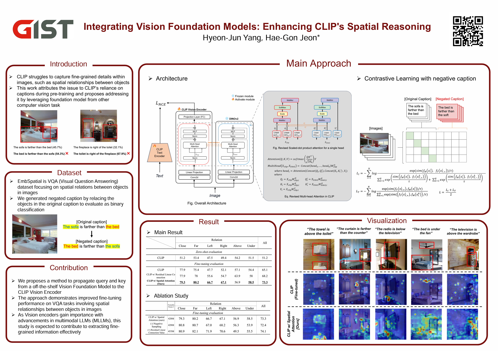
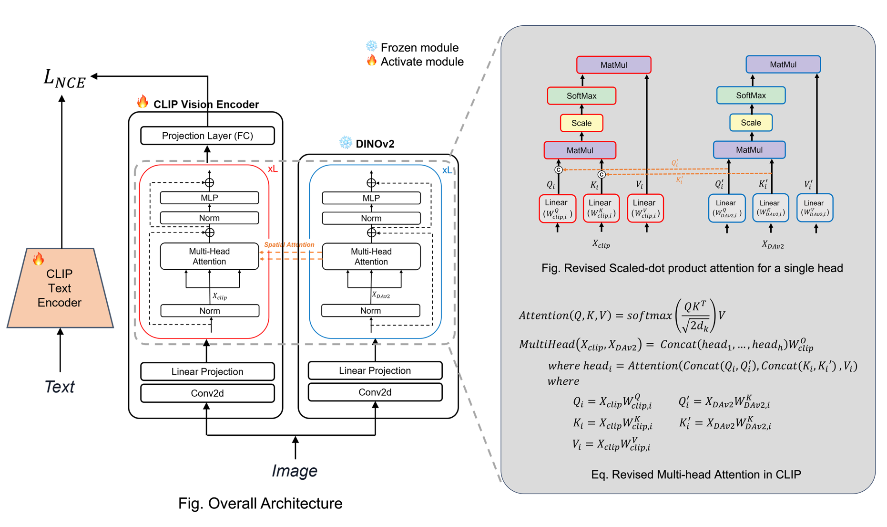
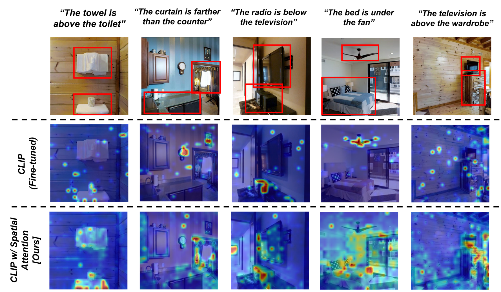

# Mixed-Transformer

## Poster




## Approach 



## Installation

### Environment Setting
```bash
$ git clone https://github.com/hy30n80/Mixed-Transformer.git
$ conda env create -f envi.yml
$ conda activate envi
```

### Installation for Depth Anything

Please Install [Depth Anything V2](https://github.com/DepthAnything/Depth-Anything-V2) pre-trained weights. and put them under the `DAv2_checkpoints` directory.


## Usage 


### Dataset Preparation
```bash
$ python dataset-prep.py
```

### Train (CLIP w/ Spatial Attention)
```bash
$ python train.py
```


### Test (CLIP w/ Spatial Attention)

Please Install [Depth Anything V2](https://github.com/DepthAnything/Depth-Anything-V2) finetuned weights. and put them under the `checkpoints` directory.

```bash
$ python train.py --only evaluation True --checkpoint_path 
```


### Train (CLIP w/ Spatial Attention + Residual Linear Connection in Ablation)
```bash
$ python train.py
```


### Test (CLIP w/ Spatial Attention + Residual Linear Connection in Ablation)

Please Install [Depth Anything V2](https://github.com/DepthAnything/Depth-Anything-V2) finetuned weights. and put them under the `checkpoints` directory.

```bash
$ python train.py --only evaluation True --checkpoint_path
```


## Visualization

